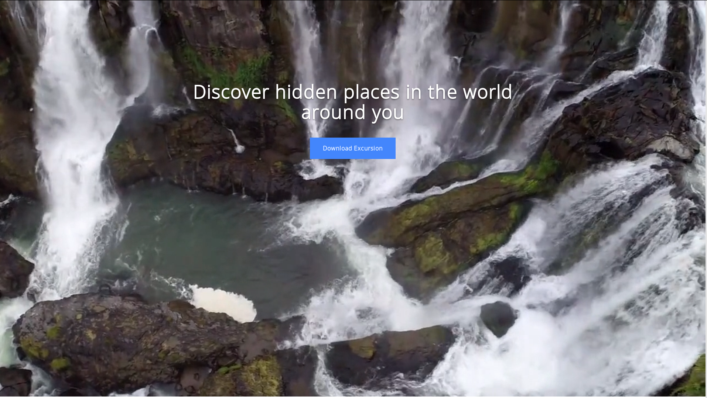

 This is a Front-end project built with HTML, CSS and Bootstrap that have an example of how to put a video in the background of your website and how set up to start and repeat automatically. 

Feel free to use this template/model in your own project. If you want to see this project online, you'll find it in my<a href="http://codepen.io/LuKrebs/full/GWLxpw/">CodePen profile</a>.

Here is a image of what this project looks like: 

